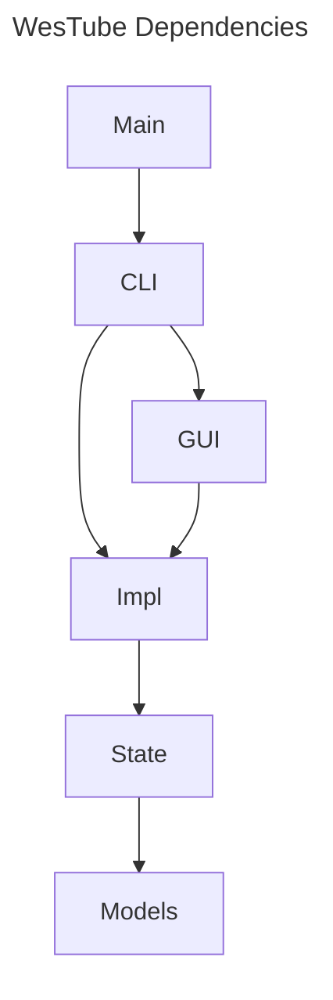

# WesTube

Tools for producing the YouTube Channel of the Washington Ethical Society

# Development Install

I haven't worked out a non-development installation procedure yet. So this is also the
user installation method.

## For Windows:

Install scoop using the directions on [their website](https://scoop.sh/)

Below is to install PyTorch for Cuda 12.8. The
[PyTorch website](https://pytorch.org/get-started/locally/). will give you the command
to deal with a different version if scoop installs something incompatible.

```cmd.exe
scoop install cuda
python3.13 -m venv .venv
.venv\Scripts\activate
pip install torch torchvision torchaudio --index-url https://download.pytorch.org/whl/cu128
pip install -r requirements.txt
pip install -e .
```

# Broad plan

Since this is currently a manual process, I intend to create individual, tiny Python
sub-commands to automate each step — allowing me to incrementally incorporate them into
the manual workflow as I complete each one and leading to good encapsulation. I plan to
use JSON to communicate between the stages of the pipeline (primarily because it is in
the Python standard library). I was thinking of using `pydantic` to specify the JSON, so
I can ensure that the reader and writer program are using the same definition. I also
want to make sure that I don't forget to add error handling (e.g., "failed because could
not find any faces in the input video file ...") to the communication format.

I will no longer be trying to create a single executable (at least not at the
beginning). Or make a system useful for someone else. I get 95% of the value by
automating my chore into a single command.

# Implementation plan

This is copied from my "Automate WES YouTube" page in LogSeq. 🍀Hopefully, I'll update it
regularly.🍀

(When pasting, replace `- TODO` with `- [ ]` and `- DONE` with `- [x]`)

- [x] Get the sound alignment research code working. I'll start with
  [SyncNet](https://github.com/joonson/syncnet_python) but may move to
  [MTDVocaLiST](https://github.com/xjchenGit/MTDVocaLiST) if performance is not good
  enough. MTDVocaLiST requires more complex pre-processing for the face extraction. (At
  least they require the FAN model, but they are following WAV2Lip. And the FAN model
  looks like it just uses yet another simpler model to do the bounding box generation
  and then generates the facial features from there.)
- [ ] Port the sound alignment research code to my repository
- [ ] Write sound alignment calculator program - it needs to output JSON for downstream
  program use - JSON format should include error handling
- [ ] Write sound alignment adjustment program - it should read the JSON from the
  alignment calculator
- [ ] Install and use WhisperX to generate time-coded transcripts with speakers
- [ ] Write calculate main start and end-points program using the WhisperX outputs - it
  needs to write JSON for downstream program use
- [ ] Write trim to start-and-end-points program - it should read the output of the
  calculate main start and end-points
- [ ] Write calculate platform start and end-points program using the WhisperX outputs
- [ ] Write a pipeline automating all the video processing
- [ ] Write a find the Google Docs platform folder (and presentation?) for a given date
  program - it should output JSON for later steps
- [ ] Write an identify the primary title slide program - Start with Platform Address
  slide - it should output JSON and read the result of the presentation-finding step -
  Allow for later expansion for meetings that do not have a platform address (like The
  Winter Festival)
- [ ] Write a create the YouTube thumbnails presentation from slide program (select and
  duplicate just that slide to an appropriately-named presentation)
- [ ] Write a "create thumbnails slides" program - it should read the output of the
  YouTube thumbnails presentation creator - its output should include the platform
  address title or meeting title. - Version 1 may support only "Platform Address" slides
- [ ] Write a download thumbnails as PNGs (or JPEGs) program, it should read the output
  of the "create thumbnails slides" program
- [ ] Write an upload-to-YouTube program - it should read the output of the video
  pipeline and the thumbnail creation slides
- [ ] Write a "create YouTube description" program - it should read the input from
  WhisperX
- [ ] Upgrade the YouTube Uploader to use the output from "create YouTube description"
- [ ] Upgrade the "identify primary title slide" program to work with
  non-platform-address meetings
- [ ] Upgrade the "create thumbnails" slides to handle non-platform meetings
- [ ] Upgrade the pipeline program to include slide processing and uploading

# Old plan (and why I changed)

Below is the old plan for how to implement the system. I originally wrote it with the
hope that AI vibe-coding could help me create the full system. However, the AI was not
sophisticated enough and I ended up spending a lot of time in yak-shaving. I would have
gotten more done if I'd done everything myself.

So, the new plan breaks the system up into many smaller programs. Hopefully, an AI will
be able to handle those simpler assignments. (And if not, I'll pick up the slack.😉)

I'm keeping the plan around for now so that I can refer to it as I write the new plan.

______________________________________________________________________

# Tech Stack

The code will be Python, built with pants a single PyOxidizer executable - the
executable will be entirely self-contained, though it will be able to read configuration
from the persistent state database. That way volunteers from the Ethical Society can
download and run a single file.

The primary users will be using Windows, though the application should also run on
Linux. It would be nice to run it on Mac, but I don't have a Mac to test it on.

It will use Pytest for tests, mypy for type safety, and ruff for static analysis and
linting. Mutability will be avoided as much as possible. Where it is used, it will be
clearly documented.

It will keep persistent state in a SQLite database, which it will access through
SQLAlchemy. It will transparently migrate those state files to the latest version using
Alembic (whose config will be programmatically defined so the user only needs to have
the application installed).

For video editing, it will use the PyAV library. PyAV is self-contained, not reliant on
an external FFmpeg installation, which will make it easier to distribute.

We will use PyTorch for running internal AI models. The main model will be one to
calculate video and audio offsets so we can sync them.

We will use requests to interact with APIs.

We will use PySide for the GUI.

The command line will be composed of subcommands. Command-line parsing will be done with
argparse. But the argument parsing will have a wrapper that returns a dataclass so the
rest of the code is type-safe.

# Code standards

Python code will be written for Python 3.10 (PyOxidizer only works up to 3.10).

All code will be fully annotated with types and docstrings.

Types will use the lower-case versions of `list`, `dict`, etc. introduced in Python 3.9.
They will also use the `foo | None` syntax rather than `Optional[foo]`.

Docstrings for functions will include all arguments and return value. Docstrings for
classes will include a description of the class and a list of attributes. Module
docstrings will be concise.

Mutability will be avoided as much as possible. Where it is used, it will be clearly
documented.

# Code organization

We will create several packages:

- `wes_tube`: The main package.
- `wes_tube.cli`: The command line interface.
- `wes_tube.gui`: The GUI.
- `wes_tube.models`: The data models.
- `wes_tube.state`: The persistent state.
- `wes_tube.impl`: The implementation of the business logic.

The main package will primarlily be used for initializing the other packages. It will
depend on the `cli` package.

The `cli` package will be used for the command line interface. One command will be
`wesTube gui` (this will also be the default command). Other than this, the `cli`
package will be independent of the `gui` package. No other packages will depend on the
`cli` package or the `gui` package.

The `impl` package will will be reorganized later as we add more features. The `impl`
package will not depend on the `gui` package or the `cli` package.

Here is a diagram of the dependencies:


