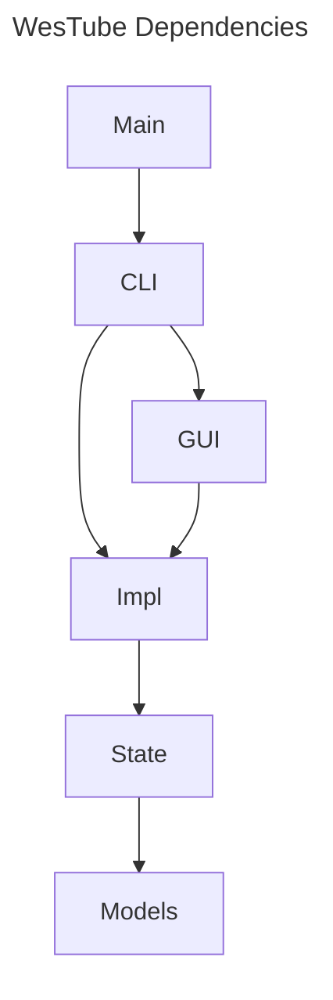

# WesTube

Tools for producing the YouTube Channel of the Washington Ethical Society

# Tech Stack

The code will be Python, built with pants a single PyOxidizer executable - the executable will be entirely self-contained, though it will be able to read configuration from the persistent state database. That way volunteers from the Ethical Society can download and run a single file.

The primary users will be using Windows, though the application should also run on Linux. It would be nice to run it on Mac, but I don't have a Mac to test it on.

It will use Pytest for tests, mypy for type safety, and ruff for static analysis and linting.
Mutability will be avoided as much as possible. Where it is used, it will be clearly documented.

It will keep persistent state in a SQLite database, which it will access through SQLAlchemy. It will transparently migrate those state files to the latest version using Alembic (whose config will be programmatically defined so the user only needs to have the application installed).

For video editing, it will use the PyAV library. PyAV is self-contained, not reliant on an external FFmpeg installation, which will make it easier to distribute.

We will use PyTorch for running internal AI models. The main model will be one to calculate video and audio offsets so we can sync them.

We will use requests to interact with APIs.

We will use PySide for the GUI.

The command line will be composed of subcommands. Command-line parsing will be done with argparse. But
the argument parsing will have a wrapper that returns a dataclass so the rest of the code is type-safe.

# Code standards

Python code will be written for Python 3.10 (PyOxidizer only works up to 3.10).

All code will be fully annotated with types and docstrings.

Types will use the lower-case versions of `list`, `dict`, etc. introduced in Python 3.9. They will also use the `foo | None` syntax rather than `Optional[foo]`.

Docstrings for functions will include all arguments and return value. Docstrings for classes will include a description of the class and a list of attributes. Module docstrings will be concise.

Mutability will be avoided as much as possible. Where it is used, it will be clearly documented.

# Code organization

We will create several packages:

- `wes_tube`: The main package.
- `wes_tube.cli`: The command line interface.
- `wes_tube.gui`: The GUI.
- `wes_tube.models`: The data models.
- `wes_tube.state`: The persistent state.
- `wes_tube.impl`: The implementation of the business logic.

The main package will primarlily be used for initializing the other packages. It will depend on the
`cli` package.

The `cli` package will be used for the command line interface. One command will be `wesTube gui` (this will also be the default command). Other than this, the `cli` package will be independent of the `gui` package. No other packages will depend on the `cli` package or the `gui` package.

The `impl` package will will be reorganized later as we add more features. The `impl` package will not depend on the `gui` package or the `cli` package.

Here is a diagram of the dependencies:

